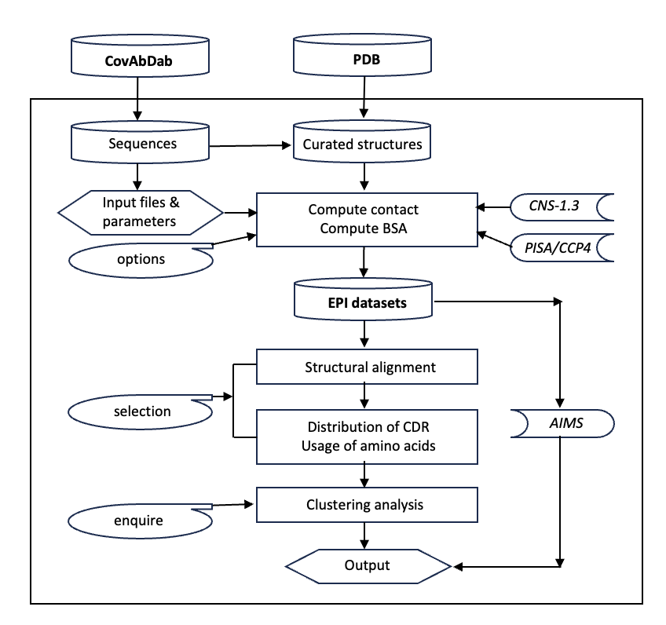

# EPI

# Description

To analysis the binding interface of antibody/nanobody in complex with Receptor Binding Domain (RBD) of Spike (SARS-CoV-2), we developed a software package of EPI (Epitope-Paratope Interaction).  The package is a mixed scripts of C-shell, perl and python language and utilize CNS 1.3 (http://cns-online.org/v1.3/) (Brunger, Adams et al. 1998) and PISA (Proteins, Interfaces, Structures and Assemblies (Krissinel and Henrick 2007)).  The package is able to analyze large number of structures of complexes of antibody and antigen from PDB (Protein Data Bank).

**Flowchart of EPI software package**

# Features

1.	For a giving list of antibody and spike structures (pdb ids) that are downloaded from PDB, build up an EPI dataset
2.	Identify the epitope sites (common or frequently contact sites on RBD surface)
3.	Analysis the contacted amino acids of antibody in binding to Epitope Sites (ES) on the RBD
4.	Statistical analysis the CDR loops contributions
5.	Clustering analysis based on ES and identify the binding motifs of antibody
6.	Write out Pymol scripts for graphical display
7.	The user can make query the epitope-paratope interaction data for a specific antibody/pdb-id/class/ES-sites, and ask for the similar antibody those bind to the same ES sites for comparison

# References
Jiang, J. et al. "SARS-CoV-2 antibodies recognize 23 distinct epitopic sites on the receptor binding domain", **Nat.Commun.Biol., 6, 953, 2023**.
(https://www.nature.com/articles/s42003-023-05332-w)

# Documentations

# Further Reading

# Acknowledgements
